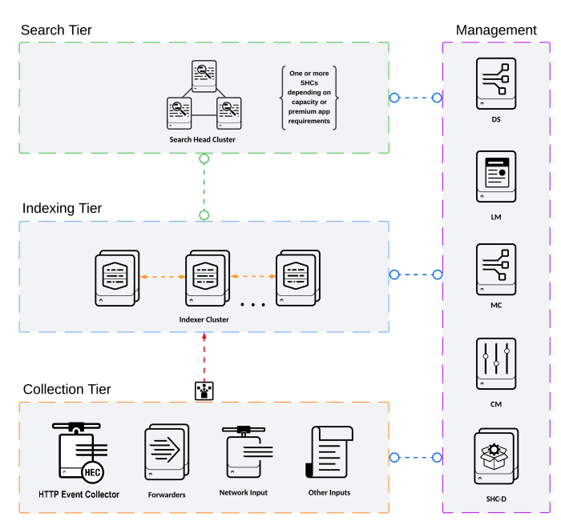

# Splunk Validated Architecture Lab (C3/C13, Single Site)

This repo provisions and configures a **single-site distributed Splunk lab** aligned to the **Splunk Validated Architectures (C3/C13)** journey.

## Architecture (Visualization)



## Phase Plan

### Phase 1 (Current State — Working)

Phase 1 brings up a stable distributed deployment with Indexer Clustering and a Search tier connected to the cluster manager.

- 1 Bastion/Controller (public subnet)
- 1 Cluster Manager + License Manager (node 6)
- 3 Indexers (nodes 3-5)
- 3 Search Heads (nodes 0-2)

Provisioning is done with Terraform from your local machine.  
Configuration is done with Ansible from the Bastion host.

**Deployed capabilities in Phase 1**

- Cluster Manager (Indexer Cluster)
- License Manager
- Indexer peers joined to the Cluster Manager
- Search Heads configured to use the indexer cluster for search

**Not yet implemented (planned for Phase 2)**

- Search Head Clustering (SHC) + Deployer
- Monitoring Console (MC)
- Deployment Server (DS)

### Phase 2 (Next — SHC Single Site C3/C13)

Phase 2 will extend this lab toward a healthier SVA-aligned single-site design by adding:

- SHC (captain/members) and SHC Deployer pattern
- MC placement and distributed monitoring configuration
- DS decision/placement and client management approach
- Repeatable health checks and validation gates

## Prerequisites

- AWS credentials configured for Terraform
- Terraform 1.5+
- OpenSSH client (`ssh`, `scp`)
- For Windows flow: PowerShell
- For Unix flow: `bash`, `python3`

## 1) Provision Infrastructure

From `terraform/`:

```powershell
terraform init
terraform plan
terraform apply
```

Expected outputs include:

- `bastion_public_ip`
- `all_splunk_private_ips`
- `manager_private_ip`
- `searchhead_private_ips`
- `indexer_private_ips`

## 2) Push Ansible to Bastion and Build Inventory

From repo root:

### Windows

```powershell
.\deploy-ansible-to-bastion.ps1
```

Optional (also runs playbook on bastion):

```powershell
.\deploy-ansible-to-bastion.ps1 -RunPlaybook
```

### Unix/macOS/Linux

```bash
chmod +x ./deploy-ansible-to-bastion.sh
./deploy-ansible-to-bastion.sh
```

Optional (also runs playbook on bastion):

```bash
RUN_PLAYBOOK=true ./deploy-ansible-to-bastion.sh
```

What this step does:

- Reads Terraform outputs
- Regenerates `ansible/inventory.ini` with live private IPs
- Copies `ansible/` to `/home/ec2-user/ansible` on bastion

## 3) Run Ansible From Bastion

If you did not use the optional auto-run flag, SSH to bastion and run:

```bash
cd /home/ec2-user/ansible
ansible-playbook -i inventory.ini site.yml
```

## 4) Validate Cluster Health

On bastion, validate services:

```bash
ansible -i /home/ec2-user/ansible/inventory.ini splunk_cluster -m shell -a "sudo /opt/splunk/bin/splunk status"
```

Check cluster manager status:

```bash
ssh -i ~/.ssh/id_rsa ec2-user@<manager_private_ip> "sudo /opt/splunk/bin/splunk show cluster-status -auth admin:<password>"
```

Check peer registration from manager:

```bash
ssh -i ~/.ssh/id_rsa ec2-user@<manager_private_ip> "sudo /opt/splunk/bin/splunk list cluster-peers -auth admin:<password>"
```

## 5) OpenVPN Note

The OpenVPN installer script is downloaded during bastion bootstrap, but not auto-executed (to avoid cloud-init hangs).

Run manually on bastion when ready.

Install the server:

```bash
cd /home/ec2-user
sudo ./openvpn-install.sh install
```

Create a client profile:

```bash
sudo ./openvpn-install.sh client add splunk-lab
```

## Troubleshooting

- `ssh` permission errors on Windows private key:
  - Re-run `.\deploy-ansible-to-bastion.ps1` (it enforces key ACLs via `icacls`).
- Terraform fails with Splunk AMI lookup returning no results:
  - Confirm your AWS account is subscribed to the Splunk Marketplace AMI in `us-east-1`.
  - Use manual override in `terraform.tfvars`:
  - `splunk_ami_id = "ami-xxxxxxxxxxxxxxxxx"`
  - You can then run `terraform plan`/`apply` without marketplace name lookup dependency.
- Ansible cannot connect to private nodes:
  - Confirm bastion has `/home/ec2-user/.ssh/id_rsa`
  - Confirm SG rules permit private subnet traffic
  - Confirm inventory was regenerated after latest `terraform apply`
- Splunk API/auth failures:
  - Ensure `splunk_admin_password` in Terraform and Ansible vars match
  - Ensure `splunk_secret` is consistent across roles

## Security Reminder (Lab Defaults)

Before long-lived usage:

- Replace default admin password and shared secret values
- Restrict bastion SSH/VPN source CIDRs from `0.0.0.0/0` to trusted IPs
